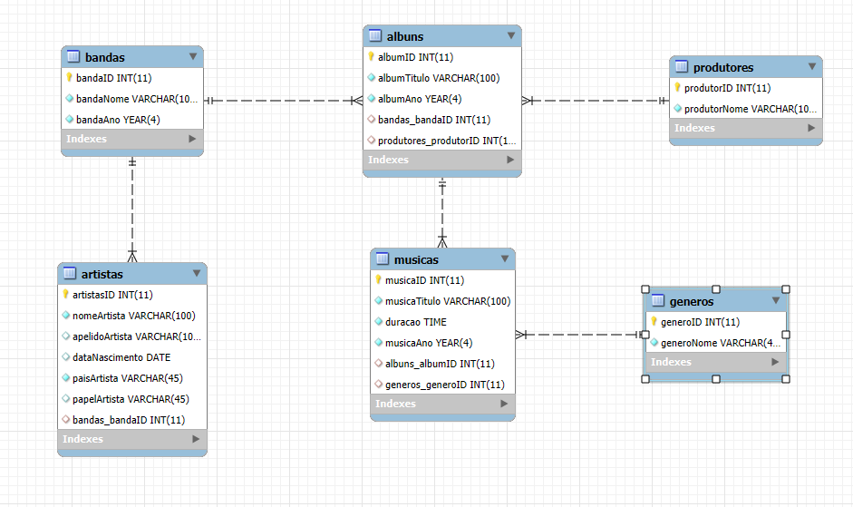

# 🎵 Projeto MySQL – Base de Dados "musica"

Este projeto consiste na modelação, construção e preenchimento de uma base de dados relacional MySQL dedicada à gestão de informação sobre bandas, artistas, álbuns e músicas. O objetivo principal foi aplicar os conhecimentos adquiridos em SQL e modelação de dados, simulando um cenário realista de produção musical.

---

## 🗂️ Estrutura da Base de Dados

A base de dados está organizada em 6 tabelas principais:

-   **bandas** – Nome e ano de formação de bandas musicais
-   **artistas** – Informações pessoais e papel de cada artista numa banda
-   **produtores** – Identificação dos produtores responsáveis pelos álbuns
-   **albuns** – Registo de álbuns lançados por bandas
-   **generos** – Lista de géneros musicais
-   **musicas** – Músicas por álbum, género, duração e letra (opcional)

O diagrama ER pode ser visualizado abaixo:



---

## 📦 Ficheiros incluídos

| Ficheiro                | Descrição                                                |
| ----------------------- | -------------------------------------------------------- |
| `musica.sql`            | Script de criação, inserção e alteração da base de dados |
| `Diagrama_dbmusica.png` | Diagrama relacional das tabelas e suas ligações          |
| `Caso Prático.pdf`      | Documento do enunciado e desenvolvimento passo a passo   |

---

## 🔧 Funcionalidades Desenvolvidas

-   Criação de base de dados `musica` com todas as tabelas
-   Inserção de:
    -   Bandas como GNR, Dire Straits, Bryan Adams, Silence 4
    -   Álbuns reais com dados históricos
    -   Mais de **50 músicas**, com duração, ano, género
    -   Artistas e respetivos papéis
-   Inserção e atualização de letras (ex: _Walk of Life_)
-   Consultas SQL de seleção com `JOIN` e ordenações
-   Criação de `VIEW` personalizada
-   Exportação e restauro de backup SQL
-   Eliminação de registos bonustrack com `DELETE`
-   Alteração da estrutura da base de dados com `ALTER TABLE`

---

## 🧪 Exemplos de Consultas Incluídas

```sql
-- a) Artistas por ordem alfabética
SELECT CONCAT(nomeArtista, ' ', apelidoArtista) AS Artista FROM artistas ORDER BY Artista;

-- c) Álbuns dos Dire Straits por ordem cronológica
SELECT albumTitulo, albumAno FROM albuns WHERE bandas_bandaID = 2 ORDER BY albumAno;

-- e) Informações completas da música "Walk of Life"
SELECT m.musicaTitulo, m.duracao, m.musicaAno, a.albumTitulo, g.generoNome
FROM musicas m
JOIN albuns a ON m.albuns_albumID = a.albumID
JOIN generos g ON m.generos_generoID = g.generoID
WHERE m.musicaTitulo LIKE "Walk of Life";
```

## 🧠 Objetivos Educativos

Este projeto teve como objetivos:

-   Aplicar modelação relacional (MER → MR → SQL)

-   Desenvolver autonomia na escrita de comandos SQL

-   Trabalhar com dados reais (música) de forma estruturada

-   Praticar a exportação/importação de bases de dados com .sql

## 👤 Autor

José Carlos Gonçalves
GitHub – @HoTnOoDlEs21
